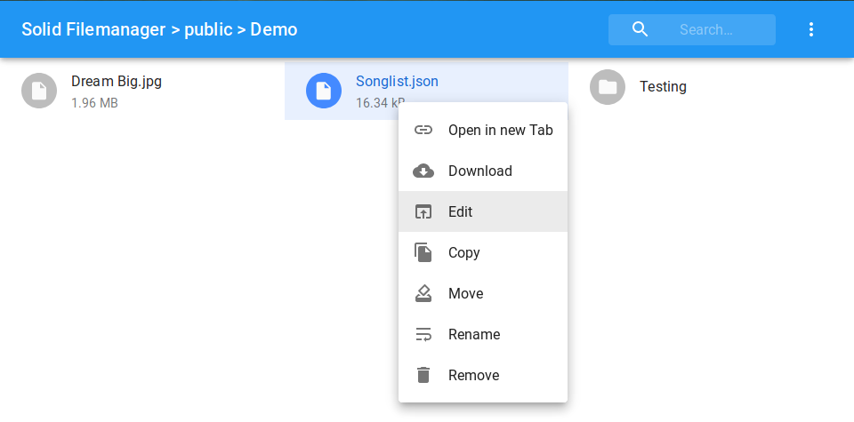

# Solid RDM

This is a solid application to manage file for solid pods, which is extended from [this solid app](https://github.com/Otto-AA/solid-filemanager/). This app is concentrated in research data management and it is an implementation of  [my thesis](https://vsr.informatik.tu-chemnitz.de/edu/studentprojects/2019/004/)

The app is available here: https://dangvu1986.github.io/ (see below for more options). To use it you need to have a [solid pod](https://solid.inrupt.com/get-a-solid-pod). If the pod is hosted with a newer server version (5.0.0+) you will need to give this app explicit permission to read/write data to your pod (go to .../profile/card#me -> click on "A" in the top -> Add "https://dangvu1986.github.io" with read/write access).

## Features

- Create an folder to contain all research data files
- Navigation through folders
- Upload files and metadata
- Copy, remove, move and rename file and folders
- Edit text files (txt, html, ...)
- View media files (video, audio and image files)
- Zip actions (archive and extract)
- Download files
- Open files in a new tab

<!--- -->

## Developing
If you want to modify this app, first make sure you've installed git, node and npm. Then enter following commands:

```shell
git clone https://github.com/dangvu1986/solid-rdm/      # Downloads the source
cd solid-filemenager                                    # Enter the directory
npm install                                             # Install dependencies
npm start                                               # Start the development app
# Make changes to the source code now
```

With `npm build` you can create a static build, but keep in mind that logging into your solid pod requires the app to run on a domain or localhost (and not `file:///C:/.../index.html`). So either deploy it (to your pod, etc.) or run it via localhost (e.g. with npm serve).